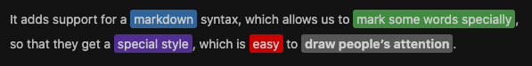

# markdown-it-color-plus

## What it is?

It adds support for a `markdown` syntax, which allows us to **mark some words
specially**, so that they get a **special style**, which is **easy** to **draw
people's attention**.

The syntax is shown below:

```markdown
{colorName}(content)
```
And we will get:
```html
<span class="`${defaultClassName}` `${prefixClassName}${colorName}`">content</span>
```
**demo shown below**:
```markdown
It adds support for a {blue}(markdown) syntax, which allows us to {green}(mark some words specially),
so that they get a {purple}(special style), which is {red}(easy) to {default}(**draw people's attention**).
```



the `html` of demo shown below:
```html
<p>It adds support for a <span class="hl-label blue">markdown</span> syntax, which allows us to <span class="hl-label green">mark some words specially</span>,<br>
so that they get a <span class="hl-label purple">special style</span>, which is <span class="hl-label red">easy</span> to <span class="hl-label default"><strong>draw people’s attention</strong></span>.</p>
```

the `style` of demo shown below:
```css
.hl-label {
  padding: 2px 4px;
  border-radius: 3px;
  color: #fff;
}
.hl-label.default {
  background-color: #777;
}
.hl-label.blue {
  background-color: #428bca;
}
.hl-label.pink {
  background-color: #ff69b4;
}
.hl-label.red {
  background-color: #f00;
}
.hl-label.purple {
  background-color: #6f42c1;
}
.hl-label.orange {
  background-color: #ff8c00;
}
.hl-label.green {
  background-color: #5cb85c;
}
```

## INSTALL

```shell
npm install markdown-it-color-plus --save
```

## USE

```javascript
var md = require('markdown-it')().use(require('markdown-it-color-plus'))
```

## API

You can add options. Default option is below.

```javascript
var md = require('markdown-it')().use(require('markdown-it-color-plus'), {
  defaultClassName: 'md-colorify', // default
  prefixClassName: 'md-colorify-', // will add `${prefixClassName}${colorName}` to class style
  inline: false, // default
})

md.render('{primary}(sample)') // => '<span class="md-colorify md-colorify-primary">sample</span>'
```

If you want to use inline style, use like below.

```javascript
var md = require('markdown-it')().use(require('markdown-it-color-plus'), {
  inline: true,
})

md.render('{red}(sample)') // => '<span class="md-colorify md-colorify-red" style="color: red;">sample</span>'
```

| OptionName | Default       | Description                                                                                                 |
|------------|---------------|-------------------------------------------------------------------------------------------------------------|
| `defaultClassName`  | md-colorify | We always add the value of `${defaultClassName}` to the class attribute of the tag                          |
| `prefixClassName` |             | We will add `${prefixClassName}${colorName}` to the class attribute of the tag                              |
| `maxColorNameLen` | 10            | We will only parse tokens whose `colorName` length does not exceed this value, if it is 0 it means no limit |
| `maxContentLen` | 0             | We will only parse tokens whose `content` length does not exceed this value, if it is 0 it means no limit   |
| `isMultiLine` | false         | When it's true, we receive content that contains newlines |

## Change Log

+ **0.0.1**: add `prefixClassName`, `maxColorNameLen`, `maxContentLen`
  , `isMultiLine` options
